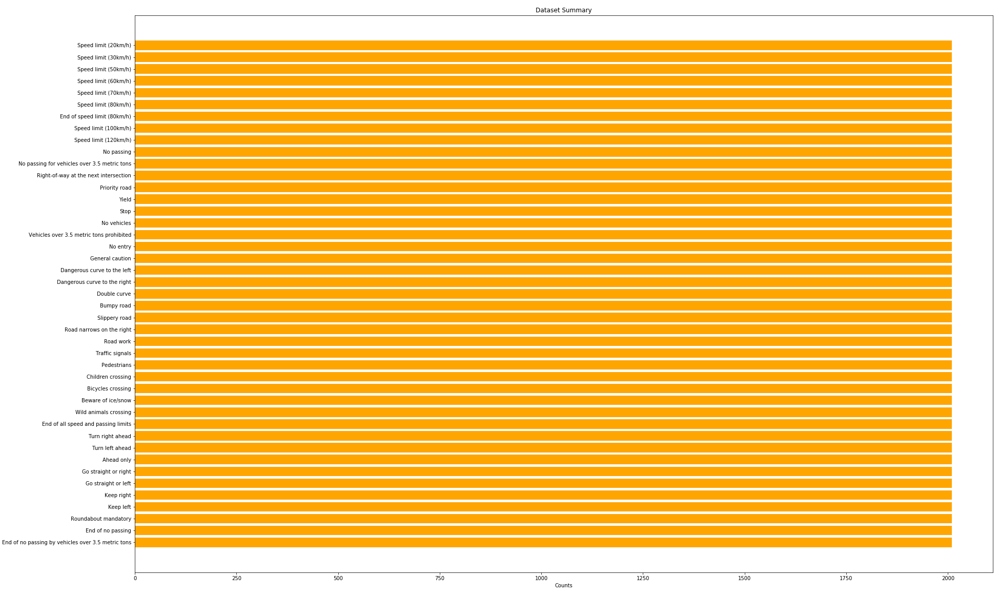

## SDC - Project 2
### Report

---

## Build a Traffic Sign Recognition Project

The goals / steps of this project are the following:
* Load the data set
* Explore, summarize and visualize the data set
* Design, train and test a model architecture
* Use the model to make predictions on new images
* Analyze the softmax probabilities of the new images


## [Rubric Points](https://review.udacity.com/#!/rubrics/481/view)

#### Source Code Structure Overview

All the source code to classify traffic signs is contained in the following notebook:

* `P2.ipynb`

### Data Set Summary & Exploration

#### 1. Provide a basic summary of the data set. In the code, the analysis should be done using python, numpy and/or pandas methods rather than hardcoding results manually.

The summary statistics computed on the traffic signs data set are as follows:

* The size of training set is `34799`
* The size of the validation set is `4410`
* The size of test set is `12630`
* The shape of a traffic sign image is ``(32, 32, 3)``
* The number of unique classes/labels in the data set is `43`


#### 2. Include an exploratory visualization of the dataset.

This section contains an exploratory visualization of the data set.

I created a bar chart from the distribution of the labels in the dataset and the distribution is as follows:

<p align="center">
  
  <p align="center">Label Distribution - Dataset Summary</p>
</p>

### Design and Test a Model Architecture

#### 1. Describe how you preprocessed the image data. What techniques were chosen and why did you choose these techniques? Consider including images showing the output of each preprocessing technique. Pre-processing refers to techniques such as converting to grayscale, normalization, etc.

I experimented with the following steps for the preprocessing of images in the dataset:

* Gray scale conversion
* Normalization

As a first step, I decided to convert the images to grayscale because all traffic signs have unique symbols and it seems logical to assume that they can be discernible by just the shape of the symbols.

Here is an example of a traffic sign image before and after grayscaling.

<p align="center">
  
  <p align="center">RGB Image of Traffic Sign</p>
</p>

<p align="center">
  
  <p align="center">Grayscale Image of Traffic Sign</p>
</p>

As a last step, I normalized the image data because having a dataset where the pixel values are all normalized means that none of the individual pixel values/features can dominate the others just by virtue of having a higher value. Moreover, normalization works well with CNNs.

#### (OPTIONAL: As described in the "Stand Out Suggestions" part of the rubric, if you generated additional data for training, describe why you decided to generate additional data, how you generated the data, and provide example images of the additional data. Then describe the characteristics of the augmented training set like number of images in the set, number of images for each class, etc.)

As we saw in the previous dataset summary section, the labels are imbalanced and this would influence the traffic sign classifier. As a result, I decided to generate additional data to balance the dataset.

To create a balanced training dataset, I OVERSAMPLED the training dataset, where I duplicated random images within a label many times until the dataset was balanced for every label.

Here is the distribution of the labels in the dataset after rebalancing it:

<p align="center">
  
  <p align="center">Balanced dataset label distribution</p>
</p>


The new augmented training dataset is now an oversampled version of the original training dataset and different instances within each label occurs multiple times within the dataset with that label.

After the oversampling, the dataset summary is as follows:

```
**********************
Summary of the dataset
**********************
Number of training examples = 86430 <---- Only the training set is oversampled
Number of validation examples = 4410
Number of testing examples = 12630
Image data shape = (32, 32, 3)
Number of classes = 43
```

#### 2. Describe what your final model architecture looks like including model type, layers, layer sizes, connectivity, etc.) Consider including a diagram and/or table describing the final model.

My final model consisted of the following layers:

| Layer         		|     Description	        					|
|:---------------------:|:---------------------------------------------:|
| Input         		| 32x32x3 RGB image   							|
| Convolution 5x5     	| 1x1 stride, valid padding, outputs 28x28x6 	|
| RELU					|-												|
| Max pooling	      	| 2x2 stride, 2x2 filter size, outputs 14x14x6 				|
| Convolution 5x5     	| 1x1 stride, valid padding, outputs 10x10x16 	|
| RELU					|					-							|
| Max pooling	      	| 2x2 stride, 2x2 filter size, outputs 5x5x16				|
| Flatten	    | Output = 400      									|
| Fully connected		| Output = 120 |
| RELU		| - |
| Dropout		| Keep Probability = 0.5 (training), Keep Probability = 1.0 (prediction)  |
| Fully connected		| Output = 84 |
| RELU		| - |
| Dropout		| Keep Probability = 0.5 (training), Keep Probability = 1.0 (prediction)  |
| Fully connected		| Output = 43 |
| Softmax		| Output = 43 |


#### 3. Describe how you trained your model. The discussion can include the type of optimizer, the batch size, number of epochs and any hyperparameters such as learning rate.

To train the model, I used the following parameters:

| Parameters         		|     Values	        					|
|:---------------------:|:---------------------------------------------:|
| learning_rate | 0.001 |
| beta | 0.01 |
| Loss function | Average cross-entropy loss |
| Regularizer |  L2 Regularizer |
| optimizer | Adam |
| Epochs | 10 |

#### 4. Describe the approach taken for finding a solution and getting the validation set accuracy to be at least 0.93. Include in the discussion the results on the training, validation and test sets and where in the code these were calculated. Your approach may have been an iterative process, in which case, outline the steps you took to get to the final solution and why you chose those steps. Perhaps your solution involved an already well known implementation or architecture. In this case, discuss why you think the architecture is suitable for the current problem.

My final model results were:

* Validation Accuracy = 0.957
* Training Accuracy = 0.996
* Testing Accuracy = 0.936

My approach to solve the problem of traffic sign classification is as follows:

* Firstly, CNNs work well for this problem because the combination of convolution layers would provide a robust feature extraction mechanism from the images and help the combination of fully connected layers approximate a complex function that would find a good "fit" to the separation between the different classes.

* I chose the LeNet architecture as a starting point.

* Since the LeNet architecture has been known to work well on classification problems like hand written letter classification, it seemed likely that it would also work for the classification of traffic signs.

* Using this architecture as is created a problem where the model could not achieve an accuracy above 93% for the validation set. It worked extremely well on the training set. This implied that the model was overfitting the dataset.

* As a result, I experimented with adding a few dropout layers in between the fully connected layers to reduce the overfitting.

* I used an L2 regularizer for the last layer of the network to further increase the generalization of the network and decrease overfitting

* The final model's performance was high (above 93%) across all the datasets (training, testing, validation) - This provides evidence that the model generalizes well and works on new "unseen" data.

The validation accuracy during the training phase is as follows:

<p align="center">
  
  <p align="center">Validation Accuracy</p>
</p>

### Test a Model on New Images

#### 1. Choose five German traffic signs found on the web and provide them in the report. For each image, discuss what quality or qualities might be difficult to classify.

Here are six German traffic signs that I found on the web:

<p align="center">
  
  
  
</p>
<p align="center">


</p>

The images above are hard to classify due to the following reasons:
* Have different sizes
* Have watermarks in them that could influence the prediction
* Have different backgrounds
* None of them are in the dataset - completely new data

#### 2. Discuss the model's predictions on these new traffic signs and compare the results to predicting on the test set. At a minimum, discuss what the predictions were, the accuracy on these new predictions, and compare the accuracy to the accuracy on the test set (OPTIONAL: Discuss the results in more detail as described in the "Stand Out Suggestions" part of the rubric).

Here are the results of the prediction:

| Image			        |     Prediction	        					|
|:---------------------:|:---------------------------------------------:|
| No Entry      		| No Entry   									|
| Ahead Right     			| Ahead Right 										|
| Right of way at next intersection					| Right of way at next intersection											|
| Keep Right	      		| Keep Right					 				|
| Roundabout			| Roundabout      							|
| 60kpmh speed limit			|  End of speed limit 80 kmph    							|


The model was able to correctly predict 9 of the 10 traffic signs in all the images tested, which gives an accuracy of `90%` similar to that of the test set accuracy `(93.6%)`.

The only image that it got the prediction wrong was on the `60 kmph` sign.

#### 3. Describe how certain the model is when predicting on each of the five new images by looking at the softmax probabilities for each prediction. Provide the top 5 softmax probabilities for each image along with the sign type of each probability.

The code for making predictions on my final model is located in the cell below the section `Step 3: Test a Model on New Images` of the Ipython notebook.

The softmax probabilities for each of the above test images are as follows:

#### Example 1:
---

<p align="left">
  
  <p align="left">Sign - No Entry</p>
</p>

| Label			        |     Prediction	        					|
|:---------------------:|:---------------------------------------------:|
| 'No entry' |  1.0 |
| 'Speed limit 20km/h' |  4.5544077e-20 |
| 'Double curve' |  3.2754584e-24 |
| 'Traffic signals' |  5.5691258e-25 |
| 'Stop' |  4.7984333e-25 |

The prediction here is accurate with an almost `100%` certainty.

#### Example 2:
---

<p align="left">
  
  <p align="left">Sign - Ahead Right</p>
</p>

| Label			        |     Prediction	        					|
|:---------------------:|:---------------------------------------------:|
| 'Turn right ahead' |  1.0 |
| 'Go straight or left' |  4.4510555e-11 |
| 'Keep left' |  2.4755906e-11 |
| 'Roundabout mandatory' |  1.1541692e-12 |
| 'Speed limit 20km/h' |  1.5786992e-13 |

The prediction here is accurate with an almost `100%` certainty.

#### Example 3:
---

<p align="left">
  
  <p align="left">Sign - Right of Way at next intersection</p>
</p>

| Label			        |     Prediction	        					|
|:---------------------:|:---------------------------------------------:|
| 'Right-of-way at the next intersection' |  0.99999893 |
| 'Double curve' |  1.0837869e-06 |
| 'Roundabout mandatory' |  2.0084341e-09 |
| 'Pedestrians' |  1.8229017e-09 |
| 'Beware of ice/snow' |  1.4521996e-09 |

The prediction here is accurate with an almost `99%` certainty.

#### Example 4:
---

<p align="left">
  
  <p align="left">Sign - Keep Right</p>
</p>

| Label			        |     Prediction	        					|
|:---------------------:|:---------------------------------------------:|
| 'Keep right' |  1.0 |
| 'Go straight or right' |  3.4998089e-30 |
| 'Roundabout mandatory' |  2.4020729e-36 |
| 'Speed limit 20km/h' |  0.0 |
| 'Speed limit 30km/h' |  0.0 |

The prediction here is accurate with an almost `100%` certainty.

#### Example 5:
---

<p align="left">
  
  <p align="left">Sign - Roundabout</p>
</p>

| Label			        |     Prediction	        					|
|:---------------------:|:---------------------------------------------:|
| 'Roundabout mandatory' |  1.0 |
| 'Keep right' |  7.1296951e-21 |
| 'Keep left' |  1.4236079e-24 |
| 'General caution' |  2.3848029e-25 |
| 'Turn right ahead' |  5.5996496e-26 |

The prediction here is accurate with an almost `100%` certainty.

#### Example 6:
---

<p align="left">
  
  <p align="left">Sign - 60kmph</p>
</p>

| Label			        |     Prediction	        					|
|:---------------------:|:---------------------------------------------:|
| 'End of speed limit 80km/h' |  0.72975272 |
| 'Speed limit 60km/h' |  0.23082833 |
| 'Speed limit 80km/h' |  0.037582275 |
| 'Speed limit 50km/h' |  0.0016182127 |
| 'Speed limit 30km/h' |  0.00021832314 |

The prediction here is wrong. However, it does predict the correct label as the second guess with a `23%` certainty. The reason the model has gone wrong here could possibly be the fact that the digit `6` is very similar to `8`, as a result, the features extracted from this image might have been very similar to that of the `End of Speed limit 80km/h` sign and as a result, the model predicted it to be the other sign.
